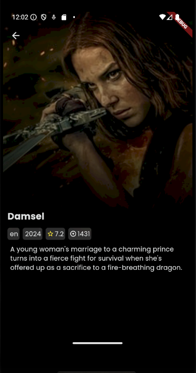
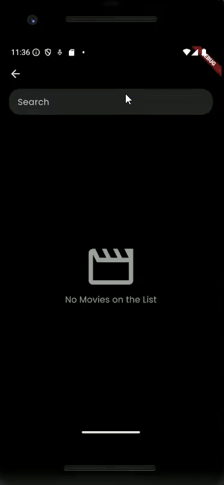

# Movies App 

Aplicativo com listagem de filmes utilizando a API [TMDB](https://developer.themoviedb.org/docs/image-basics).

Contempla:

- Tela Home
- Tela de Mais
- Tela de Detalhamento
- Tela de Pesquisa

## Descrição das telas

### Home
Contempla a listagem de filmes populares no momento, que estão para estreiar e os com maiores notas.

### Mais
Tela em que é possível verificar mais filmes das listagens que se encontram na home.

### Detalhamento
Detalha informações extras do filme. Como idioma de origem, data de lançamento, nota e posição geral do filme.

### Pesquisa
Tela em que é possiível realizar uma pesquisa de um filme através do seu título.

## Rodando o Projeto/Testes

Levando em consideração que a máquina já esteja configurada para o Flutter.
Para rodar o projeto, basta colocar para Debugar ou Rodar na sua IDE de preferência, ou rodar o comando do flutter no terminal, estando na pasta base do projeto e com algum device ativo.

> flutter run

Já para  os testes, bastar rodar o comando flutter, na pasta base do projeto.

> flutter test

Opcionalmente, caso queira obter o coverage, pode rodar:

> flutter test --coverage

## Overview do Projeto

Nessa seção irei explicar um pouco sobre o projeto, relatando escolhas feitas, como estruturação, arquitetura, escolha de pacotes, etc.

É importante enfatizar que esse projeto foi realizado em aproximadamente 3 dias, então minhas escolhas foram levando, principalmente, esse ponto em consideração.

### Arquitetura

Além do ponto principal (curto prazo), levei muito em consideração a familiaridade, para que eu conseguisse otimizar melhor o tempo previsto.

Por isso, optei pela arquitetura MVC, que acredito ser uma boa escolha para projetos pequenos.

### Packages inseridos no projeto

Os pacotes utilizados na construção desse projeto foram:

- [HTTP](https://pub.dev/packages/http) : Pacote utilizado para realizar as request para a API do TMDB.
- [Carousel slider](https://pub.dev/packages/carousel_slider) : Utilizado para facilitar a criação dos carrosséis apresentados na tela da home.
- [Shimmer](https://pub.dev/packages/shimmer) : Utilizado para facilitar a criação dos shimmers utilizados nos loadings das telas de home e mais.
- [Get It](https://pub.dev/packages/get_it) : Utilizado para injeção de dependência e acesso de objetos da aplicação
- [Build Runner](https://pub.dev/packages/build_runner) : Cosntrução das classes de mocks geradas para os testes unitários
- [Mockito](https://pub.dev/packages/mockito/example) : Criação dos mocks utilizados nos testes unitários

Todos os packages foram escolhidos levando em consideração seus pontos e popularidades no pub.dev.

### Visual/Estilização

As inspirações utilizadas para o design da aplicação foram

- Netflix
- Visual disponibilizado pelo [Mohammad Moshtaghi](https://dribbble.com/shots/22159209-Movie-streaming-app) no Dribble
- Pesquisa de ["Movie App"](https://dribbble.com/tags/movie-app) no Dribble

<u>Importante:</u> O visual do app não foi feito para seguir 100% dos items mencionados acima, eles foram utilizados apenas como inspiração.

### O que poderia ser melhorado/ O que eu teria feito diferente

#### Bugs

Atualmente no app, existe dois bugs dos quais estou ciente.

1. Teclado na tela de pesquisa: Em alguns casos ao voltar da tela de detalhamento para a tela de pesquisa, o teclado é aberto sem o Textfield estar selecionado.
2. Requisição de páginação na tela de mais: Digamos que estamos na tela de mais referente à listagem "up coming", se no infinite scroll for feita uma requisição à API da página 2 dessa listagem, e houver um erro, da próxima vez que uma requisição for feita através do infinite scroll, irá ser chamada a página seguinte, nesse caso a 3, sendo assim, acaba pulando a página em que houve o erro e os filmes continos nela não serão listados.

#### Funcionalidades que não foram implementadas

Existem algumas funcionalidade que foram pensadas no ínicio do planejamento desse projeto, porém acabaram ficando de lado devido ao prazo estipulado.

A primeira delas é a filtragem de filmes através dos gêneros. É possível observar no código, que foi feita a implementação da requisição, porém não foi adicionado nas telas finais.

A segunda é a liberação do app tanto para portrait como landscape mode (Hoje, o aplicativo foi definido apenas como portrait pois o visual está quebrando no landscape 😅).

#### Gerenciamento de Estado

Atualmente o app realiza a gerência de estado com as funções bases do Flutter, o que é suficiente, para o que tinha em mente para o projeto. Porém acredito que a adoção de algum outro gerenciamento/padrão, como o BLoC, por exemplo, deixaria o código com uma manutenabilidade melhor.

#### Testes 

Na atual versão do app, há a presença de testes unitários no controller apenas. Então com toda certeza, uma melhoria seria a adição de mais testes, tanto das classes e métodos criados como dos widgets.

Além disso seria importante realizar testes de responsividade, para a melhor adequeação do design em diferentes tamanhos de telas.

#### Tratativa de Erro

Erros referentes as requisições realizadas na home estão sendo tratados de forma genérica, o ideal seria melhorar essas tratativas. Além disso, adicionar tratativas nas demais telas/requisições do projeto.

#### Arquitetura

Com a quantidade de endpoints existem no TMDB, existe muitas funcionalidades que poderiam ser adicionados ao projeto. Dessa maneira se o fator tempo não fosse o principal ponto levado em consideração nesse projeto, eu mudaria a minha escolha de arquitetura para Clean Arch. Acredito que com ela, o projeto, ficaria mais organizado e mais fácil de dar manutenção.

